<p align="center">
  <a href="https://eeman1113.github.io/rouged/">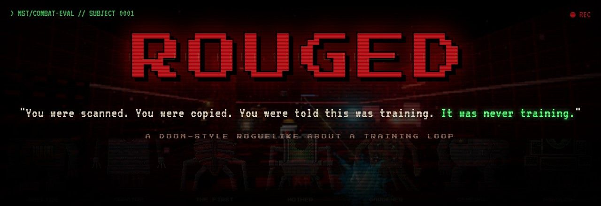</a>
</p>

<p align="center">
  <a href="https://eeman1113.github.io/rouged/"></a>
  <a href="https://eeman.itch.io/rouged"></a>
  
  
  <br/>
  
  
  
  
</p>

<br/>

> [!CAUTION]
> **DIRECTORATE // NST PROGRAM — ORIENTATION PACKET 1.0**
>
> Welcome, Candidate. You have been selected for **Neural Scan Transfer**. Your mind has been preserved at 99.8% fidelity.
> Complete combat evaluation to qualify for upload into a CHASSIS-class body. You will walk again. You will serve again.
>
> Evaluation is conducted in a simulated facility designated **ROUGED**. Death within the simulation is non-permanent.
> Subject will be restored from checkpoint. Subject will be restored from checkpoint. Subject will be ███████████████
>
> *The Directorate thanks you for your sacrifice.*

<br/>

## `> FILE 01` — WHAT YOU ARE

**ROUGED** is a first-person roguelike shooter that plays like DOOM and loops like Hades. You clear rooms, take powerups, die, and wake up in the same small white room. Every time, something there has changed.

You are a scanned copy of a soldier's mind, fighting through a training simulation so you can earn an upload into a real body.

The upload never comes. You are not being trained. **You are the training data.** Every kill and every death you suffer is fed into the machines fighting a war you will never see.

The game is built to be addictive, because that's what it's about. **The genre is the story.**

<br/>

## `> FILE 02` — THE DESCENT

Seven sectors, five rooms each, with a **Warden** at the end of every sector. After the third Warden, each boss fight ends with a choice: **EXTRACT** and walk out with what you've earned, or **GO DEEPER**. The Handler waits at room 35. Past it lies **the Endless**, where the sectors loop forever and everything keeps getting harder.

<table>
  <tr>
    <td width="50%">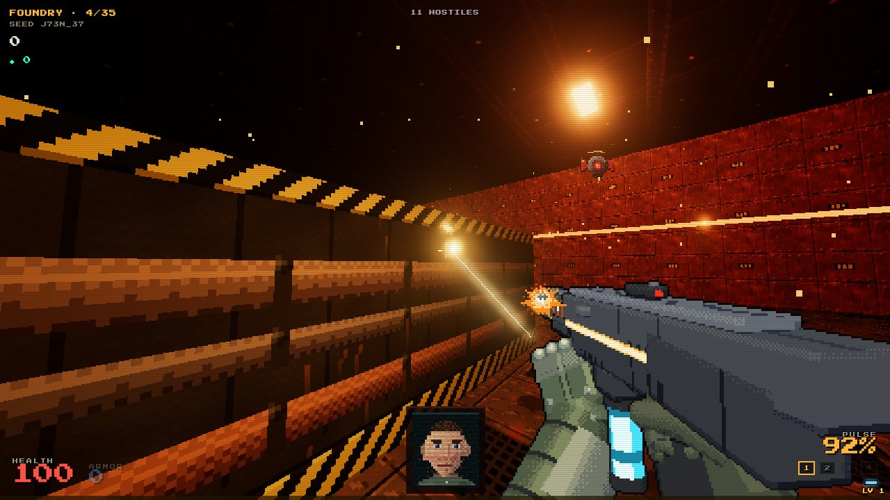<br/><b>01 · FOUNDRY</b> — <i>smelting &amp; reclamation.</i> Rust, molten light, the first lie.</td>
    <td width="50%">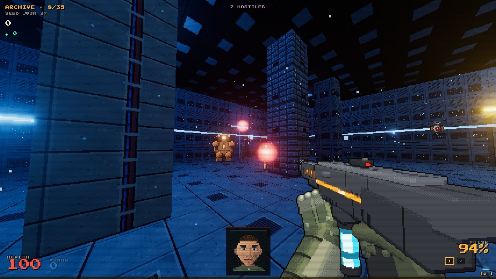<br/><b>02 · ARCHIVE</b> — <i>cold storage.</i> Servers humming with everyone who came before.</td>
  </tr>
  <tr>
    <td>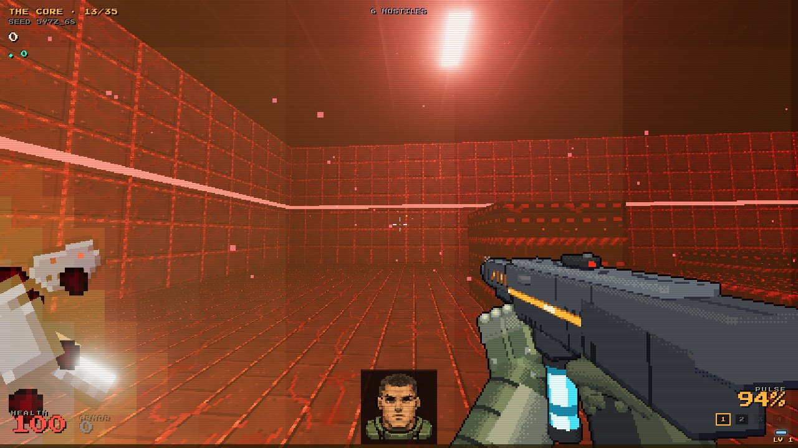<br/><b>03 · THE CORE</b> — <i>organic-metal.</i> It pulses. You don't want to know with what.</td>
    <td>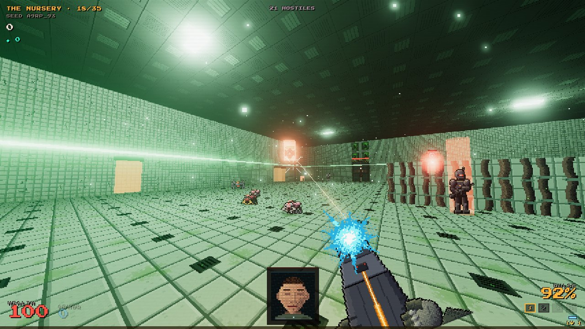<br/><b>04 · THE NURSERY</b> — <i>where the bodies are kept.</i> The ones they promised you.</td>
  </tr>
  <tr>
    <td>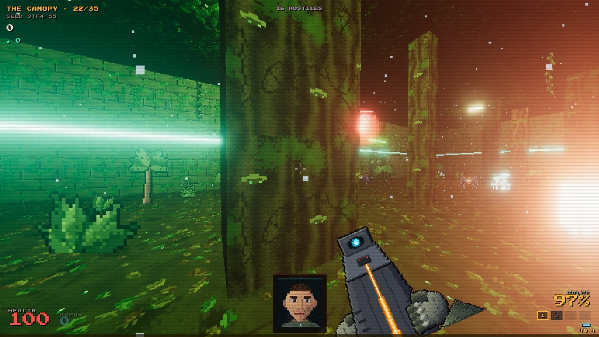<br/><b>05 · THE CANOPY</b> — <i>a jungle rebuilt from your memories.</i> Rain on leaves. The green noise.</td>
    <td>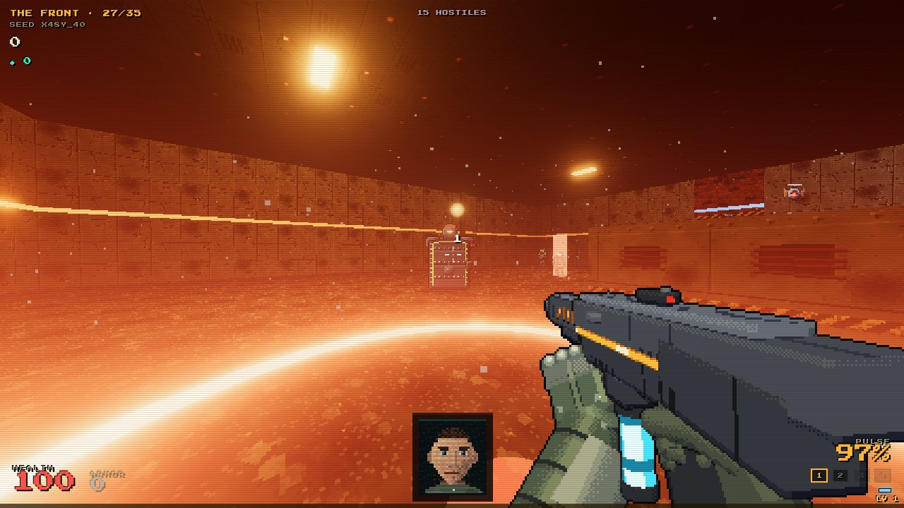<br/><b>06 · THE FRONT</b> — <i>the real war, simulated.</i> Ash, trenches, soldiers who move like you.</td>
  </tr>
  <tr>
    <td>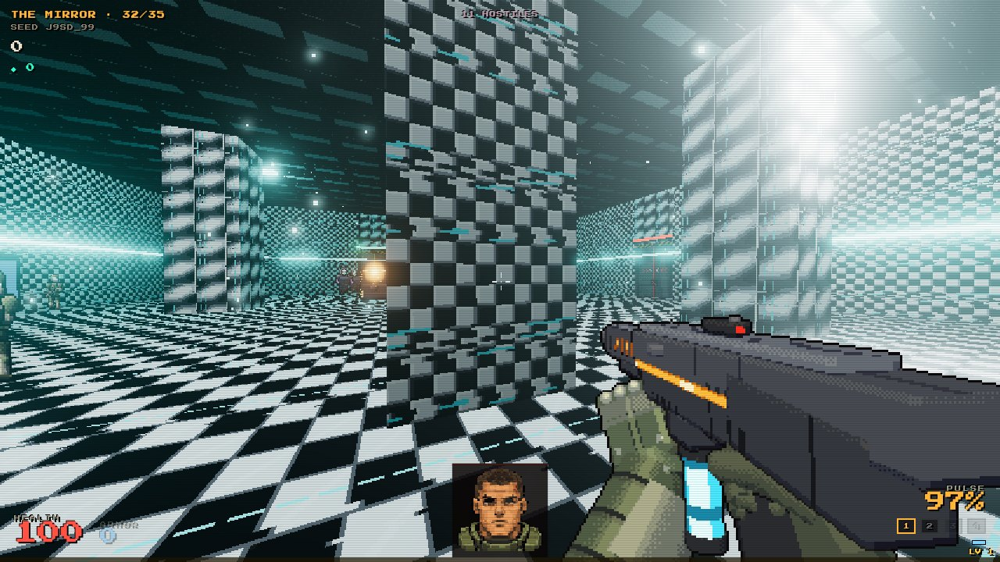<br/><b>07 · THE MIRROR</b> — <i>inside the Handler.</i> Black, white, and very quiet.</td>
    <td>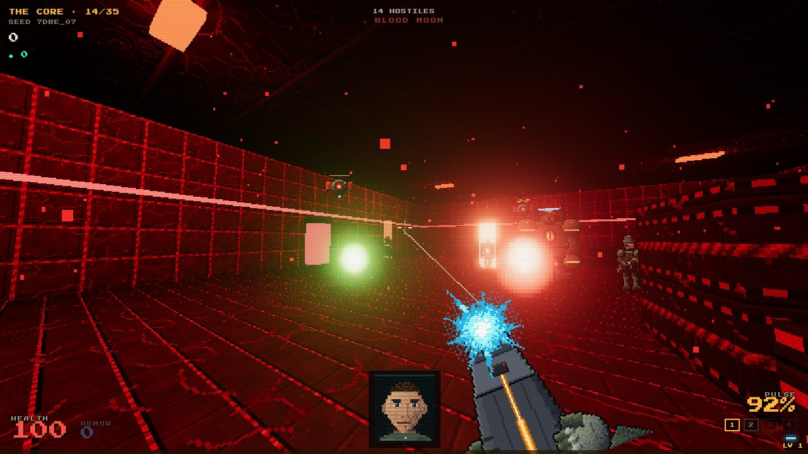<br/><b>∞ · THE ENDLESS</b> — <i>DEPTH 36+.</i> There is no floor here. Only further.</td>
  </tr>
</table>

<br/>

## `> FILE 03` — THREAT REGISTRY

<p align="center">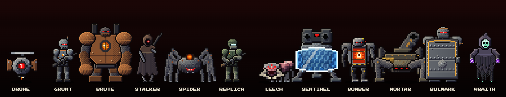</p>

Every hostile is meant to be identified at a glance: by its silhouette, its color, and its sound.

| UNIT | THREAT | HOW TO SURVIVE IT |
|:--|:--|:--|
| **DRONE** | Swarms, then dives | Shoot it first. It's fodder. |
| **GRUNT** | 3-round bursts, takes cover | Strafe through the gap between bursts |
| **BRUTE** | Winds up, then charges | When the core glows, dash sideways |
| **STALKER** | Cloaked sniper with a laser sight | Keep moving. The laser tracks you slowly. |
| **SPIDER** | Mines and acid lobs | Watch the floor |
| **REPLICA** | Fights the way *you* fought last run | Expect to recognize it |
| **LEECH** | Latches on and drains you | **Dash** to throw it off |
| **SENTINEL** | Turret behind a front shield | Flank it. It turns slower than you run. |
| **BOMBER** | Sprints at you and detonates | Pop it next to its friends |
| **MORTAR** | Artillery with telegraphed impact rings | Get out of the circle |
| **BULWARK** | Tower shield that blocks frontal fire | Shoot over the rim, or hit it from behind |
| **WRAITH** | Blinks around, fires seeking hexes | It always reappears in your line of sight |

Below 15% HP, an enemy **staggers**: its core cracks open and glows. Get close and **glory kill** it for health. Standing still gets you killed; killing keeps you alive.

<br/>

## `> FILE 04` — WARDENS

<p align="center">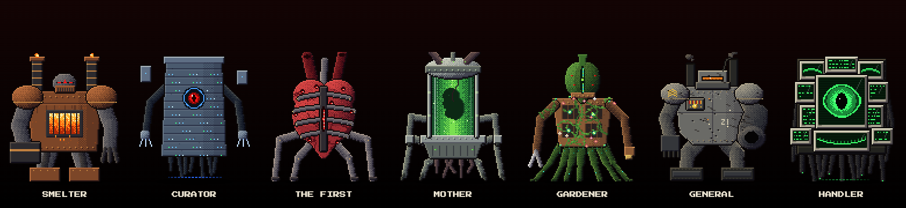</p>

<table>
  <tr>
    <td width="33%">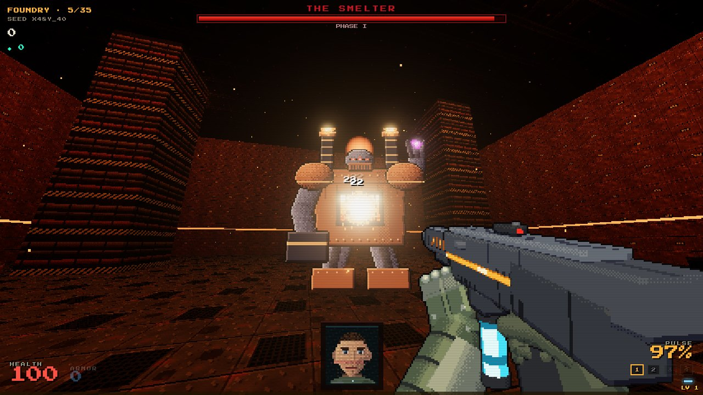<br/><b>THE SMELTER</b><br/><i>"Into the furnace, copy."</i></td>
    <td width="33%">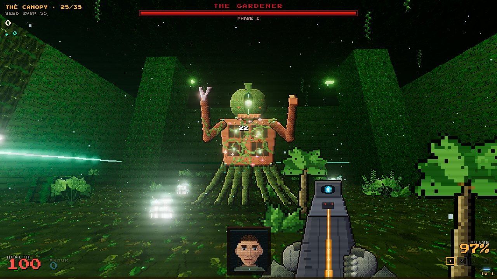<br/><b>THE GARDENER</b><br/><i>"Weeds. You are weeds in a good memory."</i></td>
    <td width="33%">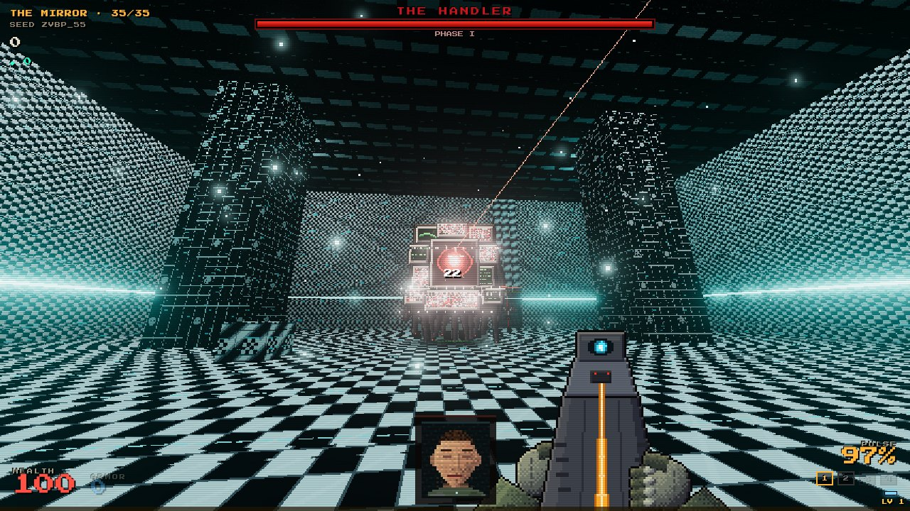<br/><b>THE HANDLER</b><br/><i>"YOUR OLD ONES. I'M SORRY."</i></td>
  </tr>
  <tr>
    <td colspan="3">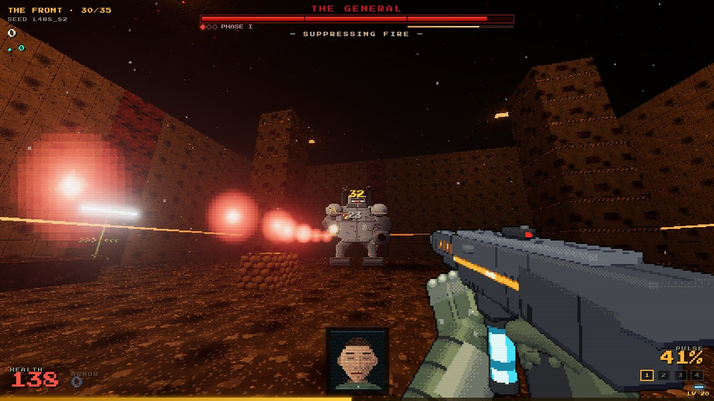<br/><b>THE GENERAL</b> — <i>"Soldier. Fall in. You have been at war for eleven years."</i></td>
  </tr>
</table>

Seven Wardens, each a fight of its own: **5–9 learnable moves** with readable wind-ups, combos, and **three phases** that each change the arena. Every damaging attack gets at least 0.6s of warning on Normal.

- **Break meter.** Damage (more of it on the glowing weak point) fills it until the Warden **kneels for 3s and takes +50%**.
- **Glory finisher.** At 0 HP it kneels one last time: `[F] END IT`.
- **Set-piece transitions.** Lava lanes flood the Foundry, the Archive's lights go out and pylons shield the Curator, the Mother births a brood, the Gardener grows thorn walls, the General calls in artillery, and the Handler fractures into echoes and inverts the room.
- **Dodge with your body.** Jump the shockwave rings, slide or duck under high beams, hop over low sweeps.

| WARDEN | SIGNATURE MOVES |
|:--|:--|
| **THE SMELTER** | Molten Leap · Furnace Rush · Crucible Spin · Furnace Vent |
| **THE CURATOR** | Index Gaze · Stack Collapse · Re-Shelve · Archive Purge |
| **THE FIRST** | Heartbeat · Artery Lash · Mimicry · Vein Burst |
| **THE MOTHER** | Birthing · Umbilical · Amniotic Rain · Lullaby |
| **THE GARDENER** | Root Eruption · Strangler Vines · Watering Lance · Overgrowth |
| **THE GENERAL** | Call Artillery · Siege Cannon · Tread Charge · Walking Barrage |
| **THE HANDLER** | Memory Replay · Full Scan · Correction · Fracture. *It warns you before every attack. Sometimes it can't go through with it.* |

<br/>

## `> ARMORY` — FOUR WEAPONS, ALL AT ONCE

<p align="center">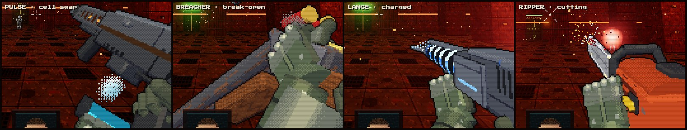</p>

You carry all four weapons at once, and switching is instant. Each one is drawn as a hand-animated 3/4-view viewmodel, with its own reload, inspect and recoil, plus a sprint pose.

| | WEAPON | FEEL |
|:--|:--|:--|
| `1` | **PULSE** | 480 rpm energy rifle. Your first shot always hits dead centre. Reload: the spent cell vents vapour and a fresh one is slapped in. |
| `2` | **BREACHER** | Rusted double-barrel. It breaks open after every shot and the shells tumble out. Knocks enemies back hard. |
| `3` | **LANCE** | Hold to charge. The coils light up one by one, and the beam pierces everything in its line. |
| `RMB` | **AIM** | PULSE: red-dot, 1.6×. BREACHER: shouldered, tighter cone. LANCE: full sniper scope, 3.2×. |
| `4` | **RIPPER** | Chainsaw. Infinite fuel. Any staggered enemy it touches becomes a glory kill. |

<br/>

## `> FILE 05` — THE DOPAMINE ENGINE

> *"The shooting is the excuse. The feedback is the game."*

Every kill fires a full stack of feedback at once:

```
hitmarker ─ rising hit-tick ─ damage number ─ blood spray ─ screen shake ─ KILL DING + sub thump
kill feed ─ +score popup ─ combo x1→x10 ─ XP bar pulse ─ gore & dismemberment ─ music layer ─ the face grins
```

<table>
<tr><td valign="top" width="50%">

**STREAKS**
| | |
|:--|:--|
| 2 in 3s | `DOUBLE KILL` |
| 3 in 5s | `TRIPLE KILL` |
| 4 in 6s | `MEGA KILL` |
| 5+ | **`RAMPAGE`** |

The combo multiplier counts up with every kill and **drops back to x1 when you die.** You're most afraid of losing it right when you're doing best.

</td><td valign="top" width="50%">

**THE SLOT MACHINE**
| RARITY | ODDS |
|:--|:--|
| ⬜ Common | 55% |
| 🟦 Rare | 28% |
| 🟪 Epic | 13% |
| 🟨 **Legendary** | **4%** |

You choose one of two pedestals, and the other shatters. There are 37 powerups and **9 hidden synergies** that are never explained. You have to find them.

</td></tr>
</table>

<br/>

## `> FILE 06` — DOORS, ROOMS, MUTATORS

The color of a door tells you what's behind it. Choosing a door is the strategy layer.

| DOOR | BEHIND IT |
|:--|:--|
| 🟦 **STANDARD** | Combat, a 3-wave arena, or a timed gauntlet |
| 🟥 **ELITE** | 50% more enemies, a third pedestal |
| 🟨 **???** | Anything, with rare loot guaranteed |
| 🟩 **CORRUPTED** | An anomaly room, a terminal, a piece of the truth |
| 💠 **THE BROKER** | A shop. Spend **scrap**, the residue of deleted minds. |
| 🤍 **SANCTUARY** | A shrine that heals you, and a terminal holding *her* recordings |
| 🟪 **TRIAL** | Beat the clock to earn a **legendary** |
| ⬜ **EXTRACT** | Walk out. *(It leads back to the hub. It always does.)* |

Some doors also carry a **mutator**. Each one adds a score bonus:

`LIGHTS OUT` · `OVERCLOCK` · `LOW GRAVITY` · `BLOOD MOON` · `DEAD AIR` · `SWARM`

<br/>

<p align="center">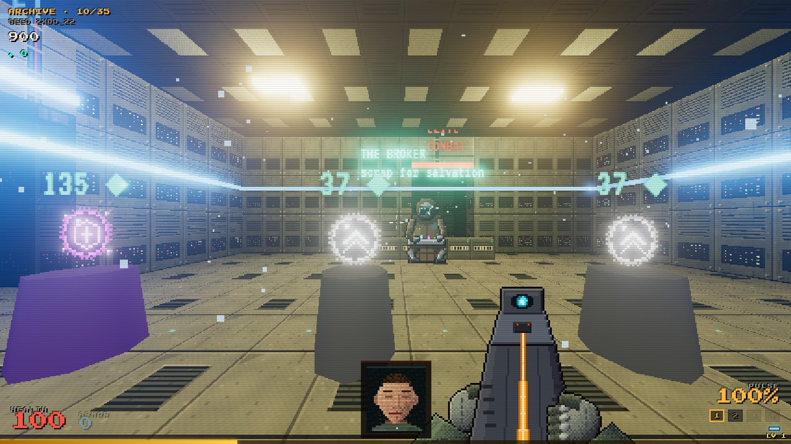<br/><i>The Broker. "You again. Or the other you."</i></p>

<br/>

## `> FILE 07` — THE CAST

Every voice in ROUGED is **synthetic**: a speech engine shaped differently for each character, with a machine-made sound bed underneath.

| VOICE | WHO |
|:--|:--|
| **THE HANDLER** | Your training assistant. Calm and professional at first, then it starts to stutter. By run 40 it's honest. |
| **THE BROKER** | Subject 0019. He sold his memories one by one. Talks over a bad radio link. |
| **MARA** | Subject 0112. She worked out the truth before you, and left tapes for whoever came next. |
| **THE WARDENS** | Huge voices, pitched down to the floor. |
| **THE ANNOUNCER** | `RAMPAGE.` |
| **THE WHISPERS** | After a few runs, the enemies start saying your name. |

> **HANDLER** · run 2 — *"Target neutralized. Well done."*
> **HANDLER** · run 30 — *"Target neutralized. Like the others."*

<br/>

## `> FILE 08` — CONTROLS

<table>
<tr><td valign="top" width="50%">

**⌨ KEYBOARD + MOUSE**
| | |
|:--|:--|
| Move | `W A S D` |
| Fire / charge Lance | `LMB` hold |
| Aim / scope | `RMB` hold |
| Glory kill | `F` |
| Sprint (hold) | `SHIFT` |
| Jump (hold = bunny-hop, tap on landing = faster hop) | `SPACE` |
| Mantle | `SPACE` / `W` into a waist-to-chest-high ledge |
| Crouch · slide (while running / sprinting) | `CTRL` / `C` |
| Dash | `ALT` / `V` / mouse side buttons |
| Use / take | `E` |
| Weapons | `1–4` · wheel · `Q` |
| Pause | `ESC` |

</td><td valign="top" width="50%">

**🎮 DUALSENSE**
| | |
|:--|:--|
| Move / aim | `L-stick` / `R-stick` |
| Fire | `R2` |
| Aim / scope | `L2` |
| Glory kill | `R3` / `□` |
| Sprint (toggle, cancels when you stop) | `L3` |
| Jump | `✕` |
| Crouch · slide | `◯` |
| Use / take | `□` |
| Last / next weapon | `△` / `R1` |
| Dash | `L1` |
| Weapons | `D-pad` |
| Pause | `OPTIONS` / touchpad |

</td></tr>
</table>

**Movement:** sprint into a crouch for a power slide, jump out of it to keep the speed (slide-hopping), dash-jump to carry the burst. Jumps have coyote time and buffering; release jump early for a short hop. Firing drops you out of sprint instantly. On touch, push the move stick to the rim to sprint.

**Coming from VALORANT?** In **Settings → Import Valorant Sensitivity**, enter your sens and scoped multiplier. ROUGED converts it to the exact same cm/360 (VALORANT 0.07°/count → ROUGED 0.0022 rad/count, so ×0.5553), reads raw mouse counts, and can match VALORANT's 103° FOV. The settings screen shows your cm/360 for any DPI.

**Pro mode** (Chrome or Edge, **Controls → Enable Pro Features**, over USB or Bluetooth) adds:
- **Adaptive triggers** that change per weapon: PULSE chatters, BREACHER has a hammer break, LANCE gets tighter as it charges, RIPPER growls.
- A **lightbar** that shows your health and flashes on kills.
- **Player LEDs** that show your multiplier.
- **Gyro aiming.**

Touch controls show up automatically on phones.

<br/>

## `> FILE 09` — TECHNICAL ANNEX

> No asset files. Every sprite, texture, sound, note of music and line of dialogue is **generated at runtime**.

```bash
npm install
npm run dev        # http://localhost:5173 — solo needs nothing else
npm run server     # co-op server on :8787 (PORT to override)
npm run build      # typecheck + production build → dist/
npm run simtest    # a bot plays the full descent against the real sim, headless
```

**Where it lives:**

- GitHub Pages mirror — [`eeman1113.github.io/rouged`](https://eeman1113.github.io/rouged/) — pushed by `.github/workflows/pages.yml` on every commit to `main`.
- itch.io mirror — [`eeman.itch.io/rouged`](https://eeman.itch.io/rouged) — pushed by `.github/workflows/itch-deploy.yml` via [butler](https://itch.io/docs/butler/) on every commit to `main`. Each build's "user version" on itch is `<short-sha>-<commit-subject>` so the file history is grep-able.
- Release devlog — tag a release (`git tag v0.2.0 && git push origin v0.2.0`) and `.github/workflows/itch-devlog.yml` posts a devlog on itch summarising every commit since the previous tag.

**Co-op:** in the menu, go to **CO-OP DEPLOY** and enter the server address (`wss://` when you're playing from an HTTPS page). Up to four players share a seed and a combo multiplier, and anyone can drop in mid-run.

```
shared/   constants · protocol · seeded RNG · room generator · physics · weapon/enemy/powerup defs
server/   the authoritative Run sim: AI, 7 Wardens, combat, powerups, progression
          (runs in Node for co-op and in the browser for solo)
client/   480p nearest-neighbour renderer + bloom · procedural pixel art · simulated gore
          · HUD & face · Web Audio sfx + layered music · voice cast · story · DualSense
```

<br/>

<details>
<summary><b>▓▓▓ RESTRICTED · DO NOT OPEN BEFORE RUN 10 ▓▓▓</b></summary>

<br/>

```
> FRAGMENT RECOVERED ............................................. [ PARTIAL ]
> SCAN DATE: 11 YEARS, 2 MONTHS AGO
> SUBJECT: 0001
> BODY 0001 ─ STATUS: RESERVED ─ ASSIGNED TO: ███████████

  the robots hesitate for 0.6 seconds near kitchens.
  no patch has been able to remove it.

> 92 fragments remain.
```

</details>

<br/>

<p align="center">
  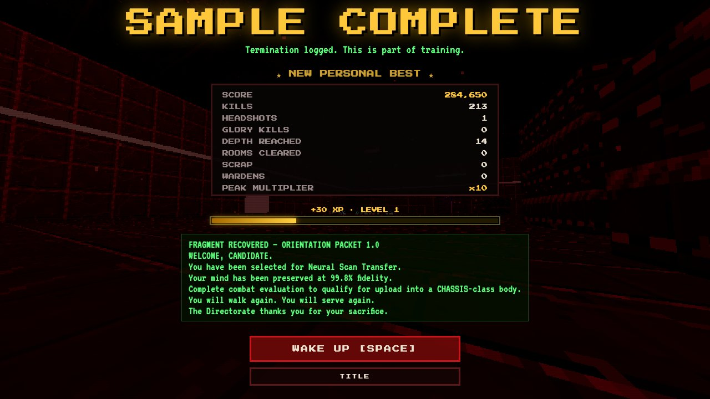<br/><br/>
  <code>DEATH IS PROGRESS · THE LOOP IS THE POINT · THE ADDICTION IS THE ART</code>
  <br/><br/>
  <b><i>"You can stop. But you won't. I know you. I made you."</i></b>
  <br/><br/>
  <a href="https://eeman1113.github.io/rouged/"><b>▶ &nbsp; WAKE UP</b></a>
  &nbsp; · &nbsp;
  <a href="https://eeman.itch.io/rouged"><b>WAKE UP ON ITCH.IO</b></a>
</p>
